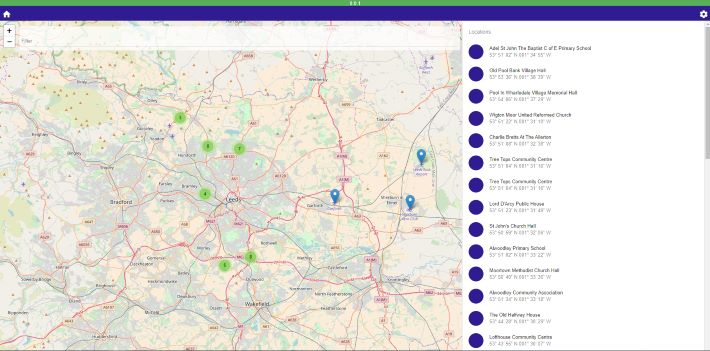
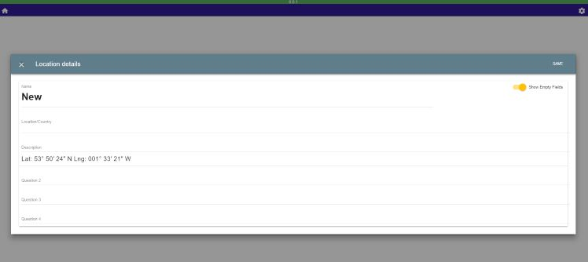

# Knowledge Hub
A place to store all your information about a location and plot it on a map. Search over your information and get an overview as well as the details.

  

### Structure
apps
 - hub (the web app)
 - api (backend)
 - mongo (mongo setup)

### Setup
1. Load both knowledge and hub images, and ensure a mongo one is available.
2. Deploy Mongo - tested with version 3.2 and 3.6 work
    Note the MONGO connection URL in the format mongo://\<user>:<pass/token>@\<host>:\<port>/\<database>, user and pass are optional
3. Deploy API - 
    Set the following environment variables:
        MONGODB_URI - URL of the mongo DB noted above
        (Optional) LOG_LEVEL - info or debug
    Then start the container. It runs listening on port 8000 within the container. It must be able to connect to the Mongo one
4. Deploy Web app - 
    Set the following environment variables:
        APP_CONFIG_VERSION - the current version (defaults to 0.0.1)<br/>
        APP_CONFIG_VERSION_COLOUR - the colour for the version bar (defaults to #58af58 which is green)<br/>
        APP_CONFIG_MAP_PROVIDER - where to get the map tiles from e.g. http://{s}.tile.osm.org/{z}/{x}/{y}.png (defaults to this OSM URL)<br/>
        APP_CONFIG_API_URL - URL of the knowledge API service (defaults to what's in .env files)<br/>
        (Optional)
        APP_SERVER_PORT - the port for the web app to listen on (defaults to 3000)
    Then start the container, it must be able to connect to the API.

Alternatively:
1. Build the images in each of the app directories.
```
    docker build -t <app name>:<version> .
```
2. Within the apps directory, start using docker compose
```
    docker-compose up
```